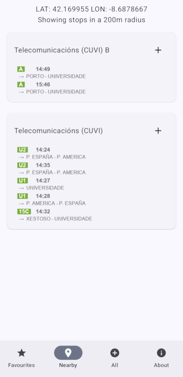

# Buses Vigo

Buses Vigo is an Android app designed for residents and frequent users of the public transport
system in Vigo who want a quick way to check the next buses arriving at a particular bus stop.
This app doesn't provide navigation or route suggestions, it is targeted to users familiar with the
city who simply need real-time bus arrival information at specific stops.

## Screenshots

  

## Features

* Real-time bus information: The data is continuously updated.
* Favourites tab: Save your most used bus stops for quick access.
* Nearby Bus Stops: Find bus stops closest to your current location.
* Search Functionality: Look up any bus stop to view upcoming buses.

## Data source

This app uses data provided by the Vigo City Council [Open Data Vigo](https://datos.vigo.org). This
application can stop working temporarily or permanently without notice because the data is obtained
directly at runtime.
